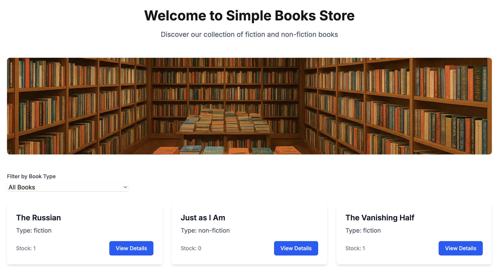

# Simple Books Store

A modern web application for browsing and ordering books, built with Next.js and Tailwind CSS.



## Features

- Browse books with filtering by type (fiction/non-fiction)
- View detailed information about each book
- Place orders for books
- View and manage orders
- Dark mode support
- Responsive design for all devices

## Tech Stack

- **Frontend**: Next.js 14 with App Router
- **Styling**: Tailwind CSS
- **API**: Simple Books API (https://simple-books-api.glitch.me)
- **Authentication**: Bearer token authentication

## Getting Started

1. Clone the repository:
   ```bash
   git clone <repository-url>
   cd simple-books-cursor
   ```

2. Install dependencies:
   ```bash
   cd frontend
   npm install
   ```

3. Set up environment variables:
   ```bash
   # Copy the example environment file
   cp .env.example .env
   
   # Edit .env and add your API access token
   # You can get an access token by making a POST request to:
   # https://simple-books-api.glitch.me/api-clients/
   # with your client name and email
   ```

4. Start the development server:
   ```bash
   npm run dev
   ```

5. Open [http://localhost:3000](http://localhost:3000) in your browser.

## Environment Variables

The application requires the following environment variables:

- `NEXT_PUBLIC_API_BASE_URL`: The base URL for the API (defaults to https://simple-books-api.glitch.me)
- `API_ACCESS_TOKEN`: Your API access token for authentication

To get an API access token:
1. Make a POST request to `https://simple-books-api.glitch.me/api-clients/`
2. Include your client name and email in the request body
3. The response will contain your access token
4. Add the token to your `.env` file

## Project Structure

```
frontend/
├── public/              # Static assets
├── src/
│   ├── app/            # Next.js app router pages
│   │   ├── api/        # API routes (proxy)
│   │   ├── books/      # Book-related pages
│   │   └── orders/     # Order-related pages
│   ├── services/       # API service
│   └── types/          # TypeScript types
├── .env.example        # Example environment variables
└── package.json
```

## Features in Detail

### Book Browsing
- View all available books
- Filter books by type (fiction/non-fiction)
- See book details including name, author, ISBN, price, and stock

### Order Management
- Place orders for books
- View all orders
- View order details
- Delete orders

### Dark Mode
The application automatically supports dark mode with:
- Dark backgrounds for better night viewing
- Proper contrast for text and interactive elements
- Consistent styling across all pages
- Smooth transitions between light and dark modes

### API Integration
The application uses a proxy API route to handle CORS and authentication:
- All API requests are routed through `/api/proxy`
- Authentication is handled automatically using environment variables
- Error handling and response transformation

## API Endpoints

The application uses the following endpoints from the Simple Books API:

- `GET /books` - List all books
- `GET /books/{id}` - Get book details
- `POST /orders` - Create a new order
- `GET /orders` - List all orders
- `GET /orders/{id}` - Get order details
- `DELETE /orders/{id}` - Delete an order

## Contributing

1. Fork the repository
2. Create your feature branch (`git checkout -b feature/amazing-feature`)
3. Commit your changes (`git commit -m 'Add some amazing feature'`)
4. Push to the branch (`git push origin feature/amazing-feature`)
5. Open a Pull Request

## License

This project is licensed under the MIT License - see the LICENSE file for details.

## Frontend
Located in the `frontend` directory, this is a NextJS application that provides the user interface for the Simple Books application.

## API Documentation
Located in the `api` directory, this contains the API documentation and specifications for the Simple Books backend services.

### Viewing the API Documentation

#### Option 1: Using Postman
1. Open Postman
2. Click on "Import" button
3. Select the `api/Simple Books API.postman_collection.json` file
4. The collection will be imported with all endpoints and example requests

#### Option 2: Using Swagger UI
1. Navigate to the `api` directory:
   ```bash
   cd api
   ```
2. Start the local server:
   ```bash
   python3 -m http.server 8000
   ```
3. Open your browser and visit: http://localhost:8000
4. The interactive Swagger documentation will be displayed

#### Option 3: Using Swagger Editor Online
1. Go to https://editor.swagger.io/
2. Copy the contents of `api/swagger.yaml`
3. Paste into the editor to view the documentation

## Getting Started

### Frontend Setup
```bash
cd frontend
npm install
npm run dev
```

### API Documentation
The API documentation can be found in the `api` directory. It includes:
- API specifications
- Endpoint documentation
- Authentication details
- Request/Response examples

## Project Structure
```
.
├── frontend/          # NextJS frontend application
├── api/              # API documentation
│   ├── Simple Books API.postman_collection.json  # Postman collection
│   ├── swagger.yaml  # OpenAPI/Swagger specification
│   └── index.html    # Swagger UI viewer
└── README.md         # This file
``` 